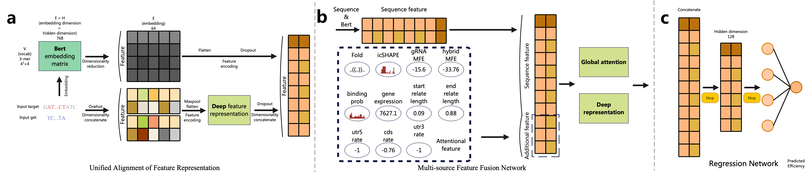
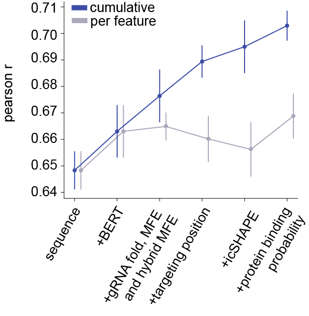
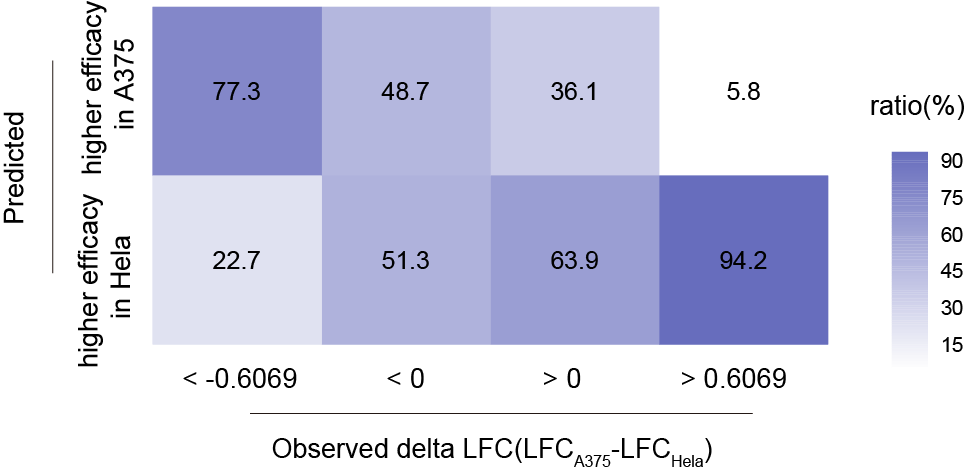

# 🧬 SCALPEL: Cell-Type Specific CRISPR-Cas13d gRNA Design using in vivo RNA Structure and Deep Learning

**Official Implementation of SCALPEL – Deciphering Cellular Context for Efficient and cell type-Specific CRISPR-Cas13d gRNA Design using in vivo RNA structure and deep learning**



## 📖 Abstract
The efficacy and tissue specificity of RNA therapeutics are critical for clinical translation. Here, by large-scale profiling of the dynamic RNA structurome across four cell lines, we systematically characterized the impact of **in vivo target RNA structure** and **RNA-protein interactions** on CRISPR/Cas13d gRNA activity. We identified the structural patterns of high-efficacy gRNA targets and observed that structural differences can lead to variations in efficacy across different cellular contexts. By stabilizing single-stranded structure, RNA-binding proteins also enhanced gRNA efficacy.

 Leveraging this cell context information, along with approximately 290,000 RfxCas13d screening data, we developed SCALPEL, a deep learning model that predicts gRNA performance across various cellular environments. SCALPEL integrates:

- **Both target and gRNA sequence**
- **In vivo icSHAPE data acorss different cell lines**
- **Cell type-specific RBP binding profiles**

SCALPEL significantly outperforms existing models, and, most importantly, enables **cell type-specific prediction** of gRNA activity. Validation screens across multiple cell lines demonstrate that cellular context significantly influences gRNA performance, even for identical targeting sequences, underscoring the feasibility of **cell type-specific knockdown** by targeting structural dynamic regions. SCALPEL can also facilitate designing highly efficient virus-targeting gRNAs and gRNAs that robustly knockdown maternal transcripts essential for early zebrafish development. Our method offers a novel approach to develop context-specific gRNAs, with potential to advance **tissue-** or **organ-specific** RNA therapies.

---

## 🧠 Key Features


- 🧬 Integrating in vivo RNA secondary structure data and cell type-specific RBP binding profile
- 🧠 Transformer-based architecture for context modeling
- 🔁 Accurately predict on-target effects of gRNAs
- 🎯 Assist in designing high-specificity gRNAs for different cellular context
- 🔬 Facilitate the design of gRNAs for animal models


---

## 📁 Repository Overview
```
.
├── dataset/                 # PyTorch dataloader and pre-processing.
├── models/                  # SCALPEL model architecture.
├── loss_functions/          # Optional loss function.
├── logicArchi.py            # Main.
```
---

## ⚙️ Environment Setup

```bash
# Install dependencies
# pip install -r requirements.txt
# pip package is in requirements.txt for python3.9
```

---

🚀 Quick Start

Step 0: Download the pre-trained BERT model at <a href="https://drive.google.com/drive/folders/1UfnmEOYFOm4fY8975KfVqlVn0kRP59fo?usp=drive_link" target="_blank" rel="noopener noreferrer">Google Drive</a>. Putting them in root directory.

Step 1: Prepare Input Data
	•	RNA sequences
	•	icSHAPE reactivity profiles
	•	RBP-binding tracks or matrices
	•	gRNA labels from CRISPR screen


Step 2: Train SCALPEL
```
python3 -u logicArchi.py control --gpu_ids=[3] --model_des='seq_bert_fold_mfe1_mfe2_icshape_binding_relatelen_utrrate' --data_des='random' --model='SCALPEL' --dataset='BertOnehotLoader30' --lr=1e-3 --data_path='/data3/SJD/Ca13TransformerDesigned3/other_model_data/ours/train_random.csv'
```
Step 3: Predict gRNA Efficacy
```
python3 -u logicArchi.py val --gpu_ids=[4] --model_des='seq_bert_fold_mfe1_mfe2_icshape_binding_relatelen_utrrate' --data_des='random' --model='SCALPEL' --dataset='BertOnehotLoader30' --data_path='/data3/SJD/Ca13TransformerDesigned3/other_model_data/ours/val_random.csv'
```

📊 Results

<p align="center">
  
  
</p>

<p align="center">
  Fig.1 In vivo information, including cell type-specific target RNA structure and protein binding probability (which also depend on cell type-specific structural data), significantly improves model performance when analyzing the impact of different features &nbsp;&nbsp;&nbsp;&nbsp; Fig.2 In our validation screen, SCALPEL performed exceptionally well in predicting gRNAs with significantly dynamic efficacy.
</p>

<!-- 
 -->


---
🧾 Citation

If you use this work in your research, please cite:
```
@article{lu2025scalpel,
  title={Deciphering Cellular Context for Efficient and Cell-Type Specific CRISPR-Cas13d gRNA Design using in vivo RNA structure and deep learning},
  author={**},
  journal={**},
  year={2025},
  note={**}
}
```


---

## 🙏 Acknowledgements

We sincerely thank the following contributors and institutions for their support:

- **Collaborating Labs and Institutes**  
  We thank all members in Sunlab at Shandong University for providing insightful discussions.

- **Funding Support**  
  This work was supported by the National Natural Science Foundation of China (No.32300521, No.32422013 and No.82341086); the Open Grant from the Pingyuan Laboratory (No.2023PY-OP-0104); the State Key Laboratory of Microbial Technology Open Projects Fund (No.M2023-20; the Intramural Joint Program Fund of the State Key Laboratory of Microbial Technology (NO.SKLMTIJP-2024-02); the Double-First Class Initiative of Shandong University School of Life Sciences; the Young Innovation Team of Shandong Higher Education Institutions, the Taishan Scholars Youth Expert Program of Shandong Province, and the Program of Shandong University Qilu Young Scholars.

- **Data Sources**  
  We gratefully acknowledge available CRISPR screen data from ****.

- **Open-source Tools**  
  This project builds upon many open-source tools and libraries, including PyTorch, Scikit-learn, and Biopython.

Special thanks to all community members and beta testers who provided feedback during model development and validation.

## 📚 Related Publication

XXXXXX

## 📚 Experimental Data Avaliability
  The icSHAPE sequencing data for all cell lines reported in this study have been deposited in the NCBI Gene Expression Omnibus (GEO) with accession number GSE301234. The validation screening sequencing data for all libraries are available in GEO under accession number GSE30081. These sequencing data have also been deposited in National Genomics Data Center (NGDC) the with accession number PRJCA042228.