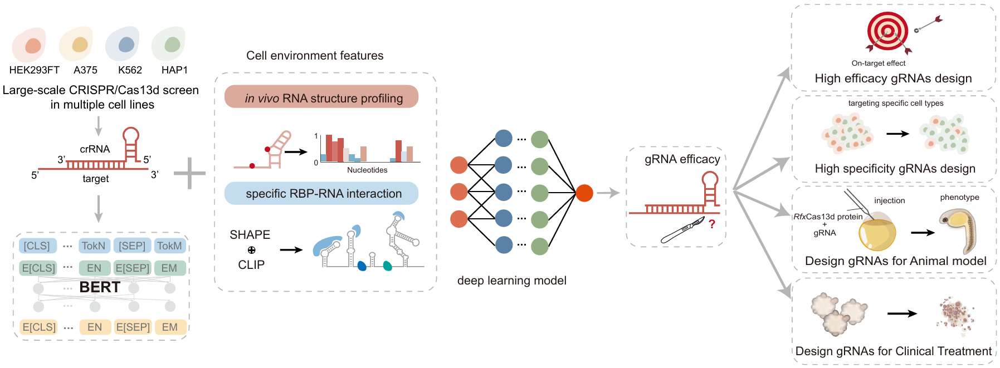
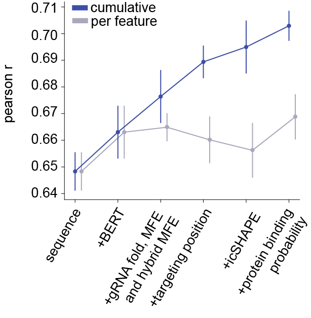
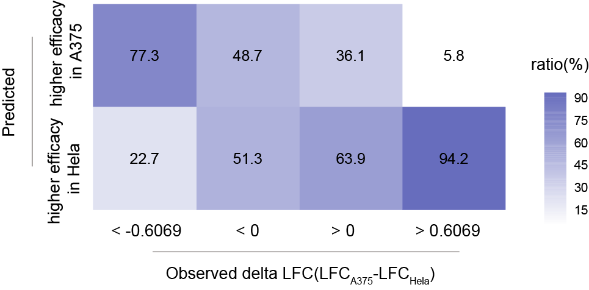

<div align="center">

# 🧬 SCALPEL: S͎pecific CRISPR-C͎as13d gRNA͎ design through deep L͎earning P͎rediction using *in vivo* E͎xperimentaL͎ RNA structure and binding information

<p>
  <a href="https://github.com/JalexDooo/SCALPEL">
    
  </a>
  <a href="https://github.com/JalexDooo/SCALPEL/stargazers">
    
  </a>
  <a href="https://github.com/JalexDooo/SCALPEL/network/members">
    
  </a>
  <a href="https://github.com/JalexDooo/SCALPEL/issues">
    
  </a>
  <a href="https://github.com/JalexDooo/SCALPEL/blob/master/LICENSE">
    
  </a>
</p>

*Official Implementation of* **SCALPEL** *– Deciphering cellular context for efficient and cell type-specific CRISPR-Cas13d gRNA design using* ***in vivo*** *RNA structure and deep learning*



</div>

---

## 🔬 Abstract

The efficacy and tissue specificity of RNA therapeutics are critical for clinical translation. By large-scale profiling of the dynamic RNA structurome across four cell lines, we systematically characterized the impact of **_in vivo_ target RNA structure** and **RNA-protein interactions** on CRISPR/Cas13d gRNA activity. We identified the structural patterns of high-efficacy gRNA targets and observed that structural differences can lead to variations in efficacy across different cellular contexts. By stabilizing single-stranded structure, RNA-binding proteins also enhanced gRNA efficacy.

Leveraging this cell context information, along with approximately 290,000 RfxCas13d screening data, we developed **SCALPEL**, a deep learning model that predicts gRNA performance across various cellular environments. SCALPEL integrates:

| Feature | Description |
|---|---|
| 🔤 **Sequence** | Both target and gRNA sequence |
| 🧬 **Structure** | *In vivo* icSHAPE data across different cell lines |
| 🔗 **Binding** | Cell type-specific RBP binding profiles |

SCALPEL significantly outperforms existing models and, most importantly, enables **cell type-specific prediction** of gRNA activity. Validation screens across multiple cell lines demonstrate that cellular context significantly influences gRNA performance, underscoring the feasibility of **cell type-specific knockdown** by targeting structural dynamic regions. SCALPEL also facilitates designing highly efficient virus-targeting gRNAs and gRNAs that robustly knockdown maternal transcripts essential for early zebrafish development.

---

## ✨ Key Features

- 🧬 Integrates *in vivo* RNA secondary structure data and cell type-specific RBP binding profiles
- 🤖 Transformer-based architecture for deep context modeling
- 🎯 Accurately predicts on-target effects of gRNAs
- 🔬 Assists in designing high-specificity gRNAs for different cellular contexts
- 🐟 Facilitates the design of gRNAs for animal models

---

## 🗂️ Repository Structure

```
SCALPEL/
├── dataset/              # PyTorch dataloader and pre-processing
├── ckpt/                 # PyTorch training model weights
├── models/               # SCALPEL model architecture
├── other_model_data/     # Training data path
├── loss_functions/       # Optional loss functions
├── Figs/                 # Figures and diagrams
└── logicArchi.py         # Main entry point
```

---

## 🛠️ Environment Setup & 🚀 Quick Start

### Step 0 — Download Pre-trained Weights

Download the following pre-trained weights and place them in the specified directories:

- **BERT model** → [Google Drive](https://drive.google.com/drive/folders/1UfnmEOYFOm4fY8975KfVqlVn0kRP59fo?usp=drive_link) — place files in the root directory
- **Trained SCALPEL checkpoints (`m9_m1`)** → [Google Drive](https://drive.google.com/drive/folders/1nAjj8YMkwAucOYOFtUO9Y00ldci53isI?usp=sharing) — place files under `ckpt/`

### Step 1 — Prepare Input Data

Prepare your input data following the format in `other_model_data/ours/demo_data.csv`. Each entry should include:

- RNA sequences
- icSHAPE reactivity profiles
- RBP-binding tracks or matrices from [PrismNet](https://www.nature.com/articles/s41422-021-00476-y)
- Other features

> The icSHAPE sequencing data for all cell lines have been deposited in NCBI GEO under accession **GSE301234**. The validation screening data are available under **GSE30081**, and in NGDC under **PRJCA042228**.

### Step 2 — Install Dependencies

```bash
pip install -r requirements.txt  # Python 3.9
```

### Step 3 — Train SCALPEL

The SCALPEL model class is implemented as `m9_m1` in `models/m9.py`. Use `--model='m9_m1'` to select it.

> **Hardware Requirements:** Due to fine-tuning of the BERT model, training is computationally intensive. Our experiments used **96 GB RAM** and **NVIDIA A100 (48 GB) / L40S (48 GB)** GPUs. A full 10-fold cross-validation training run takes **over 140 hours**. We recommend using hardware at or above this specification.

```bash
python3 -u logicArchi.py control \
  --gpu_ids=[0] \
  --model_des='seq_bert_fold_mfe1_mfe2_icshape_binding_relatelen_utrrate' \
  --data_des='random' \
  --model='m9_m1' \
  --dataset='BertOnehotLoader30' \
  --lr=1e-3 \
  --data_path='other_model_data/ours/demo_data.csv'
```

> **Note:** `model_des` configures which features to include. `data_des` accepts `cell_line:{}`, `match[i]`, `random`, or `target_gene` — refer to `train.sh` for details. Remember to update the `origin` path in the `control` function in `logicArchi.py` to point to your data files.

### Step 4 — Predict gRNA Efficacy

```bash
python3 -u logicArchi.py val \
  --gpu_ids=[0] \
  --model_des='seq_bert_fold_mfe1_mfe2_icshape_binding_relatelen_utrrate' \
  --data_des='random' \
  --model='m9_m1' \
  --dataset='BertOnehotLoader30' \
  --data_path={Your validation file path}
```

Refer to `val.sh` for more usage examples.

---

## 📈 Results

<p align="center">
  
</p>
<p align="center">
  <b>Fig. 1</b> &nbsp; <i>In vivo</i> information — including cell type-specific target RNA structure and protein binding probability — significantly improves model performance.
</p>

<br>

<p align="center">
  
</p>
<p align="center">
  <b>Fig. 2</b> &nbsp; In our validation screen, SCALPEL performed exceptionally well in predicting gRNAs with significantly dynamic efficacy.
</p>

---

## 🤝 Acknowledgements

We sincerely thank the following contributors and institutions for their support:

**Collaborating Labs and Institutes**
We thank all members of [Sunlab](https://rnalab.cn) at Shandong University for their insightful discussions.

**Funding Support**
This work was supported by the National Natural Science Foundation of China (No. 32300521, No. 32422013, and No. 82341086); the Open Grant from the Pingyuan Laboratory (No. 2023PY-OP-0104); the State Key Laboratory of Microbial Technology Open Projects Fund (No. M2023-20); the Intramural Joint Program Fund of the State Key Laboratory of Microbial Technology (No. SKLMTIJP-2024-02); the Double-First Class Initiative of Shandong University School of Life Sciences; the Young Innovation Team of Shandong Higher Education Institutions; the Taishan Scholars Youth Expert Program of Shandong Province; and the Program of Shandong University Qilu Young Scholars.

**Open-source Tools**
This project builds upon many open-source tools and libraries, including PyTorch, Scikit-learn, and Biopython.

Special thanks to all community members and beta testers who provided feedback during model development and validation in Sunlab.

---

## 📜 Related Publications

1. Cheng, Xiaolong, et al. "Modeling CRISPR-Cas13d on-target and off-target effects using machine learning approaches." *Nature Communications* 14.1 (2023): 752.

2. Wei, Jingyi, et al. "Deep learning and CRISPR-Cas13d ortholog discovery for optimized RNA targeting." *Cell Systems* 14.12 (2023): 1087–1102.

3. Wessels, Hans-Hermann, et al. "Prediction of on-target and off-target activity of CRISPR–Cas13d guide RNAs using deep learning." *Nature Biotechnology* 42.4 (2024): 628–637.

4. Zhu, Haoran, et al. "Dynamic characterization and interpretation for protein-RNA interactions across diverse cellular conditions using HDRNet." *Nature Communications* 14.1 (2023): 6824.

5. Yin, Weijie, et al. "Ernie-RNA: An RNA language model with structure-enhanced representations." *bioRxiv* (2024): 2024-03.

---

## 🖊️ Citation

If you use SCALPEL in your research, please cite:

```bibtex
@article{lu2025scalpel,
  title     = {Deciphering Cellular Context for Efficient and Cell-Type Specific
               CRISPR-Cas13d gRNA Design using \textit{in vivo} RNA structure and deep learning},
  author    = {Suiru Lu*, Jindong Sun*, Chengqian Wang*, Yongkang Tang, Liangyu Li, Shaozhen Yin, Junhao Wang, Jingwen Wang, Jiasheng Wang, Ming Shao#, Lei Sun#},
  journal   = {Nature Biomedical Engineering},
  year      = {2026},
  note      = {Under Review 2..}
}
```

---

## ⚖️ License

This project is released under the **[MIT License](https://github.com/JalexDooo/SCALPEL/blob/master/LICENSE)**.

---

<div align="center">

Thank you for using **SCALPEL**! Questions, suggestions, and feedback are always welcome.

</div>
