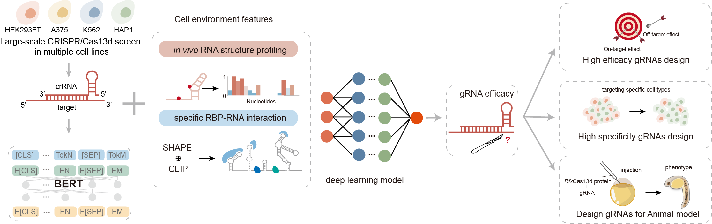

# 🧬 SCALPEL: Cell-Type Specific CRISPR-Cas13d gRNA Design using in vivo RNA Structure and Deep Learning

**Official Implementation of SCALPEL – A Context-Aware Deep Learning Framework for Predicting Cas13d gRNA Efficacy Across Cellular Environments**



## 📖 Abstract
The efficacy and tissue specificity of RNA therapeutic tools is critical for their clinical translation. In this study, we conducted large-scale in vivo RNA structure profiling across four cell lines and systematically characterized how **target RNA secondary structure** and **RNA-binding proteins (RBPs)** influence CRISPR/Cas13d guide RNA (gRNA) activity.

We observed that structural dynamics across cell types can cause the same gRNA to exhibit divergent knockdown efficiency. RBPs, by stabilizing single-stranded regions, positively modulate gRNA function. Leveraging these insights and ∼290,000 published RfxCas13d screen data, we developed **SCALPEL**, a deep learning model that integrates:

- RNA sequence
- In vivo icSHAPE data
- RBP binding profiles
- Transcript expression levels
- Cell-type identity

SCALPEL significantly outperforms existing models and, more importantly, enables **cell type-specific prediction** of gRNA activity. Validation screens across diverse cell types further confirm the biological relevance of structural context in gRNA efficacy, paving the way for **precision RNA-targeting therapeutics**.

---

## 🧠 Key Features

- 🔬 In vivo structure-aware Cas13d gRNA activity modeling  
- 🧬 Integration of RNA sequence, icSHAPE reactivity, RBP binding, expression levels  
- 🧠 Transformer-based architecture for context modeling  
- 🔁 Generalizable across multiple cell types  
- 🎯 Enables precision knockdown design for therapeutics and functional genomics  

---

## 📁 Repository Overview
```
.
├── dataset/                 # PyTorch dataloader and pre-processing.
├── models/                  # SCALPEL model architecture.
├── loss_functions/          # Optional loss function.
├── logicArchi.py            # Main.
```
---

## ⚙️ Environment Setup

```bash
# Install dependencies
pip install -r requirements.txt

# BERT model save as [https://****]
```


---

🚀 Quick Start

Step 1: Prepare Input Data
	•	RNA sequences
	•	icSHAPE reactivity profiles
	•	RBP-binding tracks or matrices
	•	gRNA labels from CRISPR screen


Step 2: Train SCALPEL
```
python3 -u logicArchi.py control --gpu_ids=[3] --model_des='seq_bert_fold_mfe1_mfe2_icshape_binding_relatelen_utrrate' --data_des='random' --model='SCALPEL' --dataset='BertOnehotLoader30' --lr=1e-3 --data_path='/data3/SJD/Ca13TransformerDesigned3/other_model_data/ours/train_random.csv'
```
Step 3: Predict gRNA Efficacy
```
python3 -u logicArchi.py val --gpu_ids=[4] --model_des='seq_bert_fold_mfe1_mfe2_icshape_binding_relatelen_utrrate' --data_des='random' --model='SCALPEL' --dataset='BertOnehotLoader30' --data_path='/data3/SJD/Ca13TransformerDesigned3/other_model_data/ours/val_random.csv'
```

📊 Results

| Model                     | Pearson r | AUC | Cell-Type Specificity |
|---------------------------|-----------|----------------|------------------------|
| Sequence-only             | X      | X           | ✗                      |
| + Structure (icSHAPE)     | X      | X           | ✓                      |
| + RBP + Expression (Full) | X  | X       | **✓✓✓**                |

🧪 SCALPEL’s predictions are validated in independent Cas13d screens, demonstrating context-aware generalization.


---
🧾 Citation

If you use this work in your research, please cite:
```
@article{lu2025scalpel,
  title={Deciphering Cellular Context for Efficient and Cell-Type Specific CRISPR-Cas13d gRNA Design using in vivo RNA structure and deep learning},
  author={**},
  journal={**},
  year={2025},
  note={**}
}
```

⸻


---

## 🙏 Acknowledgements

We sincerely thank the following contributors and institutions for their support:

- **Collaborating Labs and Institutes**  
  We thank the Bioinformatics Group and SubLab at Shandong University for providing insightful discussions and access to unpublished structural datasets.

- **Funding Support**  
  This work was supported by the National Natural Science Foundation of China (No.32300521, No.32422013 and No.82341086); the Open Grant from the Pingyuan Laboratory (No.2023PY-OP-0104); the State Key Laboratory of Microbial Technology Open Projects Fund (No.M2023-20; the Intramural Joint Program Fund of the State Key Laboratory of Microbial Technology (NO.SKLMTIJP-2024-02); the Double-First Class Initiative of Shandong University School of Life Sciences; the Young Innovation Team of Shandong Higher Education Institutions, the Taishan Scholars Youth Expert Program of Shandong Province, and the Program of Shandong University Qilu Young Scholars.

- **Data Sources**  
  We gratefully acknowledge publicly available CRISPR screen data from [Wessels et al., 2020], as well as icSHAPE and eCLIP datasets from SunLab.

- **Open-source Tools**  
  This project builds upon many open-source tools and libraries, including PyTorch, Scikit-learn, and Biopython.

Special thanks to all community members and beta testers who provided feedback during model development and validation.

## 📚 Related Publication

XXXXXX